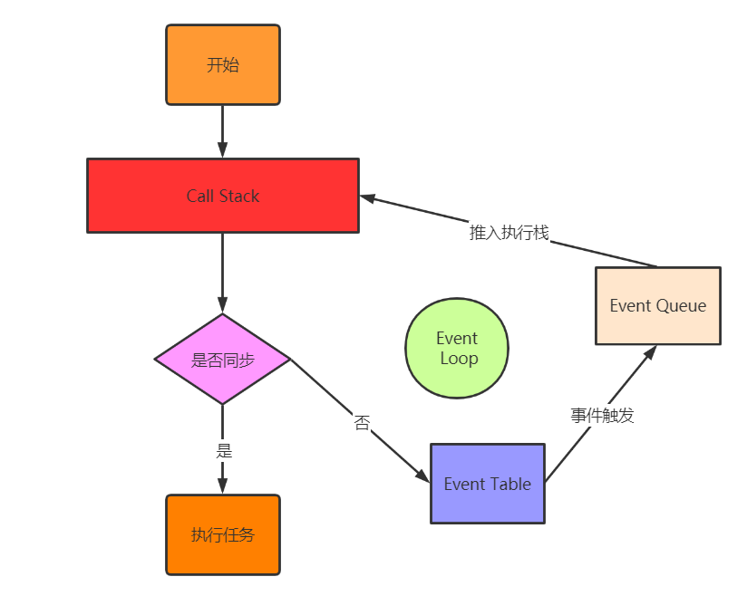
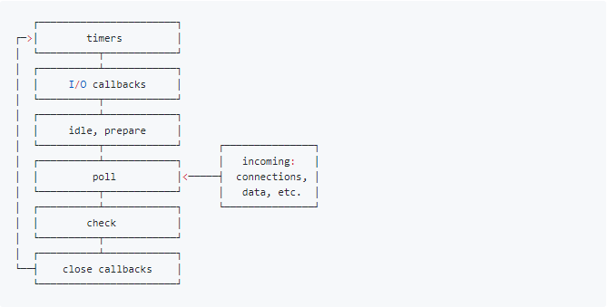

> JavaScript是单线程语言

**为什么JS是单线程的**？

JavaScript最初被设计用在浏览器中。如果有这么一个场景：现在一个线程在某个DOM节点上添加内容，另一个线程删除了这个节点，这时浏览器应该以哪个线程为准？

> 为了利用多核CPU的计算能力，HTML5提出Web Worker标准，允许JavaScript脚本创建多个线程，但是子线程完全受主线程控制，且不得操作DOM。所以，这个新标准并没有改变JavaScript单线程的本质。

# 1 EventLoop概念

JavaScript是一门**单线程**语言，和Java或go不同，在同一时间里，只允许执行一个任务，后续的代码即处于堵塞的状态。
那如果遇到网络请求或延迟执行的代码要怎么做呢？这就这涉及到了本次事件轮询中`异步代码`的执行了，让我们从原理和流程上来分析下。

## 1.1 调用栈Call Stack

调用栈顾名思义————一个装着若干即将执行的函数的栈。他的工作原理是：若函数被调用，则将它推入执行栈中，如果函数执行完成后弹出栈，继续执行下面的函数。

举个栗子：

``` js

const foo1 = () => { console.log("foo1"); } 
const foo2 = () => {
  foo1();
  console.log("foo2");
}
foo2()
```

那么调用栈的顺序是：

1. foo2函数进调用栈
2. foo1函数进入调用栈
3. foo1函数执行完毕弹出调用栈
4. foo2函数执行完毕弹出调用栈
5. 栈空

但是当出现网络请求或者定时器这种延时的时候，我们不能立即执行。这是就要用到**事件表格**和**事件队列**

## 1.2 Event Table

是一张`事件->回调函数`对应表。用来存储JavaScript中异步事件(request, setTimeout, IO等)及其对应的回调函数的列表。

## 1.3 Event Queue

是`回调函数队列`，所以它也叫Callback Queue。当Event Table中的事件被触发，事件对应的**回调函数**就会被push进这个Event Queue，然后等待被执行

## 1.4 Event Loop



- 开始后任务进入Call Stack
- 同步任务在栈中等待被顺序执行，异步任务移动到Event Table中注册
- 当对应的事件触发时，Event Table会将事件回调函数移动到Event Queue等待
- 当Call Stack中没有任务，就从Event Queue中拿出一个任务放到Call Stack

## 1.5 引擎和runtime

- **引擎**：解释并编译代码，让它变成能交给机器运行的代码。

- **runtime**：就是运行环境，它提供一些对外接口供JavaScript调用，以跟外界交互。不同的runtime提供不同的环境，比如浏览器中的window对象、DOM；Node.js环境中通过require引入模块

当然，到这里还没结束，我们要对事件循环进行更细致的划分。

# 2 浏览器的Event Loop

## 2.1 宏任务、微任务

js中的事件还可以分为宏任务、微任务：

- **macro-task（宏任务）**：包括整体script、setTimeout、setInterval

- **micro-task（微任务）**：Promise、process.nextTick

我们之前说到异步任务会进入Event Queue，这时要**判断是微任务还是宏任务，先执行微任务，再执行宏任务**。

如果把Event Queue比作银行窗口的话，那么可以将宏任务比作一个一个的客户，客户在办理业务的过程中，可能还会中途办理其他小业务，那么这些小业务就属于微任务。

## 2.2 任务执行顺序

1. 开始时执行宏任务，即我们的整体script代码
2. 中途碰到定时器等宏任务时，把他们放到宏任务队列
3. 中途碰到promise的then时把他们放到微任务队列
4. 宏任务执行结束后，检测微任务队列是否为空，不为空的话，将微任务队列中的任务依次放入调用栈中执行
5. 当没有可执行的微任务后，开始执行下一个宏任务
6. 依次类推不断循环...

## 2.3 实战分析

``` js
console.log(1);

// 定时器1
setTimeout(() => {
  console.log(2);
  // promise1
  Promise.resolve().then(() => {
    console.log(3)
  });
});

// promise2
new Promise((resolve, reject) => {
  console.log(4)
  resolve(5)
}).then((data) => {
  console.log(data);
  
  // promise3
  Promise.resolve().then(() => {
    console.log(6)
  }).then(() => {
    console.log(7)
    
    // 定时器2
    setTimeout(() => {
      console.log(8)
    }, 0);
  });
})

// 定时器3
setTimeout(() => {
  console.log(9);
})

console.log(10);
```

最后的执行结果是：
1 4 10 5 6 7 2 3 9 8 

下面我们来一步步分析为什么是这个结果？

第一阶段：

1. 第一行打印进调用栈`输出1`
2. 定时器1进调用栈，属于宏任务，放入*宏任务*队列
3. promise2进栈后立即执行，`输出4`，将promise2的回调函数放入*微任务*队列
4. 定时器3进调用栈，属于宏任务，放入*宏任务*队列
5. 最后一行打印进调用栈`输出10`

此时，第一个宏任务，也就是我们的整体script执行完毕，下面开始执行微任务队列

第二阶段：

1. promise2的回调函数进栈，`输出5`，promise3执行后它的回调进*微任务*队列
2. 下一个微任务——即刚才promise3的回调进栈执行，`输出6`，同理，它的回调进*微任务*队列
3. promise3的回调的回调进栈，`输出7`，然后将定时器2放入*宏任务*队列

到这里，微任务队列为空，我们开始执行下一轮宏任务

第三阶段：

1. 弹出宏任务的第一个任务——定时器1进栈执行，`输出2`，同时将promise1的回调放入*微任务*队列
2. 执行微任务队列中的代码，`输出3`
3. 此时微任务队列为空，执行下一轮宏任务，定时器3进调用栈，`输出9`
4. 没有微任务，所以直接进下一轮宏任务，定时器2进调用栈，`输出8`

结束...

# 3 Node.js中Event Loop

**浏览器的Event Loop遵循等待是HTML5标准，而Node.js的Event Loop遵循的是libuv。**

## 3.1 Node.js中的宏任务队列和微任务队列



各个阶段执行的任务如下：

- **timers阶段**：这个阶段执行setTimeout和setInterval预定的callback
- **I/O callback阶段**：执行除了close事件的callbacks、被timers设定的callbacks、setImmediate()设定的callbacks这些之外的callbacks
- **idle,prepare阶段**：仅node内部使用
- **poll阶段**：获取新的I/O事件，适当的条件下node将阻塞在这里
- **check阶段**：执行setImmediate()设定的callbacks
- **close callbacks阶段**：执行socket.on('close', ....)这些callbacks

#### Node.js中宏任务队列主要有4个

1. Timers Queue
2. IO Callbacks Queue
3. Check Queue
4. Close Callbacks Queue

在Node.js中，不同的macrotask会被放置在不同的宏任务队列中

#### Node.js中微任务队列主要有2个

1. Next Tick Queue：是放置process.nextTick(callback)的回调任务的
2. Other Micro Queue：放置其他microtask，比如Promise等

在Node.js中，不同的microtask会被放置到不同的微任务队列中

## 3.2 Node.js中Event Loop过程

1. 执行全局Script的同步代码
2. 执行microtask微任务，先执行所有Next Tick Queue中的所有任务，再执行Other Microtask Queue中的所有任务
3. 开始执行macrotask宏任务，共6个阶段，从第1个阶段开始执行相应每一个阶段macrotask中的**所有**任务，每一个阶段的macrotask任务执行完毕后，开始执行微任务，也就是步骤2
4. Timers Queue -> 步骤2 -> I/O Queue -> 步骤2 -> Check Queue -> 步骤2 -> Close Callback Queue -> 步骤2 -> Timers Queue ......