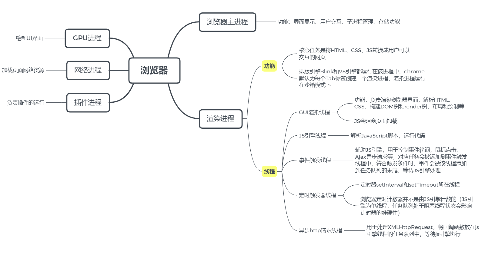
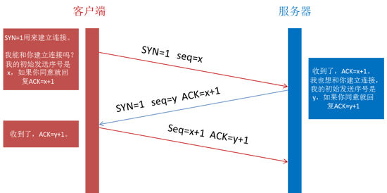

> 详解经典问题：输入url会发生什么

# 1 进程和线程

## 1.1 进程和线程的基本概念

- 进程是系统进行**资源分配**和调度的基本单位，是操作系统结构的基础
- 线程是操作系统能够进行**运算调度**的最小单位
- 进程由单个或多个线程组成
- 线程是依附于进程的，而进程中使用多线程并行处理能提升运算效率
- 同一个进程中各个线程之间共享同一块内存空间
- 进程之间**相互独立**(不同进程之间可以相互通信（IPC），不过代价很大)

> 如果浏览器是单进程会导致某个页面崩溃进而浏览器崩溃；多个界面互相可以访问相同内存也会造成安全问题，所以采用多进程模式。

## 1.2 浏览器中的进程

- **浏览器主进程（Browser进程）**：界面显示、用户交互、子进程管理、存储。控制chrome的地址栏，书签栏，返回和前进按钮
- **渲染进程**：排版引擎Blink和JS引擎V8。运行在沙箱模式下。负责页面渲染，脚本执行，事件处理等
- **GPU进程**：用于3D绘制，实现3D效果
- **网络进程**：负责页面网络资源加载
- **插件进程**：每种插件一个进程，插件运行时才会创建。负责插件的运行



# 2 请求阶段


## 2.1 处理地址栏的输入

用户在地址栏输入后，浏览器主进程的UI线程会判断用户的输入是URL还是搜索项，如果是搜索项那么发送给搜索引擎，如果是URL地址则发起网络请求。


## 2.2 URL请求过程

浏览器主进程会通过IPC把URL请求发送至网络进程，网络进程接收到URL后会发起真正的请求。
首先网络请求会查找本地缓存（强缓存、协商缓存）是否有该资源，有就直接返回资源，没有就进入请求流程。
> 先找缓存解释了第二次打开网站时加载会快很多的情况


## 2.3 DNS解析

> IP地址和域名的映射关系

- 先检查本地hosts文件是否有这个网址映射关系
- 查找本地DNS解析器缓存
- 本地DNS服务器
- 迭代查询：根域名服务器 -> 顶级域 -> 第二层域 -> 子域
- 递归查询：按上一级DNS -> 上上级 -> ... 逐级向上查询找到IP地址


## 2.4 建立TCP连接

上一步我们通过DNS解析获取到了服务器的IP地址，获取到IP地址后便会开始建立一次TCP连接，也就是我们熟悉的“三次握手”

- **第一次握手**：建立连接时，客户端发送syn包（syn=j）到服务器，并进入SYN_SENT状态，等待服务器确认。
- **第二次握手**： 服务器收到syn包，必须确认客户的SYN（ack=j+1），同时自己也发送一个SYN包（syn=k），即SYN+ACK包，此时服务器进入SYN_RECV状态。
- **第三次握手**：客户端收到服务器的SYN+ACK包，向服务器发送确认包ACK(ack=k+1），此包发送完毕，客户端和服务器进入ESTABLISHED（TCP连接成功）状态，完成三次握手。



> 三次握手成功后，客户端与服务器开始传送数据

## 2.5 浏览器发送HTTP请求

完整的HTTP请求包含`请求起始行`、`请求头部`、`请求主体`三部分。

``` 
// 请求起始行
Request URL: http://182.92.201.214:3000/login
Request Method: POST
Status Code: 200 OK
Remote Address: 182.92.201.214:3000
Referrer Policy: strict-origin-when-cross-origin

// 请求头
Accept: application/json, text/plain, */*
Accept-Encoding: gzip, deflate
Accept-Language: zh-CN,zh;q=0.9,en;q=0.8
Connection: keep-alive
Content-Length: 35
Content-Type: application/json;charset=UTF-8
Host: 182.92.201.214:3000
Origin: http://182.92.201.214
Referer: http://182.92.201.214/
User-Agent: Mozilla/5.0 (Windows NT 10.0; Win64; x64) AppleWebKit/537.36 (KHTML, like Gecko) Chrome/86.0.4240.198 Safari/537.36

// 请求体
{teacherId: 1234, password: "123"}
```


## 2.6 浏览器接收响应

服务器收到浏览器发送的HTTP请求后，会将收到的HTTP报文封装成Request对象，在通过Web服务器处理后以HTTP的Response对象返回，主要包括状态码、响应头、响应报文等。  
浏览器会解析响应头中的内容：
- 如果返回的状态码是301，网络进程会从响应头的**Location**字段里读取重定向地址。  
- 浏览器返回的数据类型也有很多种，浏览器会根据响应头的Content-Type来判断返回值的类型，如果服务器返回的是HTML，网络进程就会把数据直接发送给渲染进程；如果是zip文件或其他类型文件，这代表一次下载请求，网络进程会把数据发送给下载管理器。  

同时这个过程也会发生浏览器的**安全检查**，如果响应域和返回数据与已知的恶意站点所匹配，网络线程会告诉渲染进程展示 一个警告界面，同时为了确保不会把危险的跨域数据发送给渲染进程也会进行CORB检测。


## 2.7 准备渲染过程

当所有的检查都完成后，网络进程确定浏览器应该导航到对应的请求站点，网络进程告诉浏览器进程数据已经准备完毕，然后浏览器进程便开始去准备渲染进程。

不同源的界面，会有一个单独的渲染进程，如果是从同源的A界面打开B界面，则B界面的渲染进程会复用A界面的渲染进程。

由于网络请求需要几百毫秒才能得到响应返回，浏览器应用了一种用来**加速这个过程的优化策略**，当浏览器进程发送一个网络请求给网络进程的同时， 浏览器进程会主动尝试去查找或启动一个渲染进程，这个过程是并行执行的。使用这种方法，如果一切进展顺利的话，当网络进程接收到数据时，渲染进程已经处于待机状态了，当然如果请求被重定向的话则不会用到这个准备好的渲染进程。


## 2.8 提交文档

这里的“文档”是指URL请求的响应数据

- "提交文档"的消息是由浏览器进程发出的，渲染进程接收到"提交文档"的消息后，会和网络进程建立传输数据的"管道"。
- 文档数据传输完成之后，渲染进程会返回“确认提交”的消息给浏览器进程。
- 浏览器进程在接收到“确认提交”的消息后，会更新浏览器界面状态，包括安全状态，地址栏的URL，前进后退的历史状态，并更新Web界面。

# 3 渲染阶段


## 3.1 构造DOM

当渲染进程接收到导航过程中浏览器进程的提交文档信息并开始接收HTML数据时，主线程开始解析HTML并将其转换为DOM。
DOM是能够被浏览器理解的结构，并且通过JavaScript可以进行修改。

当HTML解析器遇到了script标签，它会暂停HTML文档的解析，并且去加载-》解析-》执行js代码，因为js中可能存在类似于document.write()这样的改变DOM结构的语句。


## 3.2 样式计算

为了计算出DOM节点中每个元素的具体样式，这个阶段大体分为三步来完成。
1. 把CSS转换为浏览器能够理解的结构，和HTML文件一样，浏览器也是无法直接理解这些纯文本的CSS样式，所以当渲染引擎接收到CSS文本，会将CSS文本转换为浏览器可以理解的结构---styleSheets。并且该结构同时具备了查询和修改功能，也就是后续的样式操作。

2. 转换样式表中的属性值，使其标准化，也就是对styleSheets的属性值进行标准化操作。

3. 计算出DOM树中每个节点的具体样式，通过CSS的继承规则和层叠规则，最终会输入每个DOM节点的样式，并被保存在ComputedStyle的结构内。


## 3.3 创建布局树

DOM树中display:none的元素是不可见的，所以需要根据DOM树和样式计算创建一个可见元素布局树。


## 3.4 分层

当某个元素上有 z-index属性时，就不能按照元素原有的顺序进行绘制，否则就会出错。

在渲染界面之前，我们需要对元素进行分层，主线程会遍历布局树进行图层的划分，如果某个元素没有得到其该有的单独的图层，可以给它添加`will-change`属性来提醒浏览器。


## 3.5 合成

现在渲染进程知道了DOM结构，每个元素的样式，元素在页面上的几何位置，元素的渲染先后。渲染进程将这些信息转换为屏幕上的像素的过程被叫做**栅格化**。

合成是一种将页面的各个部分进行分层的技术，分别对不同的图层进行栅格化，并在合成线程中作为页面进行合成。因为图层都已经被栅格化，在发生滚动的时候，只需要进行图层的移动来合成一个新的帧就行了。

当图层的绘制列表准备好之后，主线程会把该绘制列表提交给合成线程，因为有些图层可能会很大，比如有些界面需要滚动好久才能滚动到底部，这时候，合成线程就会将图层划分为图块来优先满足 浏览器可视区域的渲染，这些图块的大小通常是256X256或者512X512， 然后合成线程会按照 可视区域附近的图块来优先生成位图，这里生成位图的操作就是栅格化。

栅格化的过程会使用**GPU来加速生成**，使用GPU生成位图的过程叫做**快速栅格化**，或者**GPU栅格化**，生成的位图都被保存在GPU内存中。

一旦所有的图块都被栅格化，合成线程就会生成一个绘制图块的命令--“**Draw Quad**”, 然后将该命令提交给浏览器进程。
浏览器进程接收到命令后，会将页面内容绘制到内存中，最后再将内存显示在屏幕上。

> 使用CSS动画效果，可以避免排列和绘制阶段，直接在合成线程或光栅化线程池中进行操作，因为并没有占用主线程，所以直接合成的效率是最高的。


## 3.6 总结渲染过程

1. 渲染进程将HTML内容转换为DOM树
2. 渲染引擎将CSS样式转换为styleSheets，计算出DOM节点的样式；
3. 创建布局树，并计算出布局树的布局信息(几何信息)；
4. 对布局树进行分层，生成分层树；
5. 每个图层生成绘制列表，提交至合成线程；
6. 合成线程将图层分为图块，并在光栅化线程池中将图块转换为位图， 中间可能伴随有GPU加速；
7. 合成线程发送 DrawQuad给浏览器进程。
8. 浏览器进程根据命令消息生成页面，显示到显示器上。

